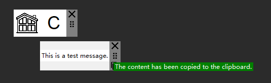

# PythonQuickToolbar
A convenient and quick-access UI floating window 
for Python users to employ their custom code powered by tkinter.
Including some custom-made toolkits.

The project is still in the early stages of construction, with many features yet to be made and implemented. 
[here](#executionmode--returntype) you can see the stage of the project's development.

<!-- TOC -->
* [PythonQuickToolbar](#pythonquicktoolbar)
  * [DEMO](#demo)
  * [Dependency](#dependency)
  * [Installation](#installation)
  * [Usage](#usage)
    * [CreateButton（Insert method）](#createbuttoninsert-method)
    * [ExecutionMode](#executionmode)
    * [returnType](#returntype)
    * [ExecutionMode : returnType](#executionmode--returntype)
  * [Contact](#contact)
  * [Acknowledgments](#acknowledgments)
    * [Program code](#program-code)
    * [Icon design and made by](#icon-design-and-made-by)
<!-- TOC -->
## DEMO

## Dependency
The following libraries are required: \
`enum`
`logging`
`tkinter`
`pyperclip`
`PIL`
 `math`
`win32clipboard`
`io`
## Installation
At the moment, pip installations are not supported, only direct source code downloads from GitHub are supported.
## Usage
``` python
import quickToolbar

def THE-FUNCTION():
    return 'RETURN-DATA'
    
quickToolbar.createButton(name = 'FUNCTION-NAME', 
                          command = THE-FUNCTION , 
                          mode = quickToolbar.ExecutionMode.Api ,
                          returnType = str , 
                          icon = 'ICON-FILE-PATH', 
                          group = None)
quickToolbar.run()
```

The logic of using this library is very simple and can be understood as follows:
1. Import library: `import quickToolbar`. 
2. Create a button (import method): `quickToolbar.createButton()`
3. Start the window: `quickToolbar.run()` \
Calling this will start the hover window and enter an internal loop, equivalent to calling tkinter's mainloop() with the same effect.

### CreateButton（Insert method）

The only method that has parameters is the method `quickToolbar.createButton()`. The specific method definition is as follows 
``` python
def createButton(name: str, command, mode: ExecutionMode, returnType=None, icon=None, group=None) -> None:
```

| Parameters   | Data Type                    | Must Be defined | Default Value | Description                                                                                                                                                                                                                                                                                     | Usage Examples                             |
|--------------|------------------------------|-----------------|---------------|-------------------------------------------------------------------------------------------------------------------------------------------------------------------------------------------------------------------------------------------------------------------------------------------------|--------------------------------------------|
| `name`       | `str`                        | Y               | ---           | Defines the name of the function button, names can't be same                                                                                                                                                                                                                                    | `name='METHOD-NAME'`                       |
| `command`    | ❓                            | Y               | ---           | Callable object❓, quickToolbar will automatically create the button to run it                                                                                                                                                                                                                   | `command=lambda: print('Hello World.')`    |
| `mode`       | `quickToolbar.ExecutionMode` | Y               | ---           | Indicate to quickToolbar how the method should be run, e.g. whether it should be run once and then finished, or repeated until the window is closed, see [here](#executionmode) for details.                                                                                                    | `mode= quickToolbar.ExecutionMode.Api`     |
| `returnType` | `quickToolbar.ReturnType`    | N               | `None`        | Indicate to quickToolbar what the data type returned by the method is, and quickToolbar will create a window for displaying the data based on that data type, or not if it's `None`, see [here](#returntype) and [here](#executionmode--returntype) for details.                                | ``returnType=quickToolbar.ReturnType.Str`` |
| `icon`       | `str`                        | N               | `None`        | Image file address, define the button icon, use a file type supported by the `PIL` library such as .png. Don't worry about the size of the image, quickToolbar will automatically scale the image.<br/> If the value is `None`,quickToolbar will use the first character of `name` as the icon. | `icon='Icons/icon.png'`                    |
| `group`      | 🚧 (Coming soon)             | 🚧              | 🚧            | 🚧  (Coming soon)                                                                                                                                                                                                                                                                               |                                            |

### ExecutionMode

|                                            | Description                                                                            |
|:-------------------------------------------|-------------------------------------------------------------------------------|
| `ExecutionMode.Api`                        | For a method that can be executed quickly and is intended to be run only once|
| `ExecutionMode.Api_Repeat`                 | For a method that can be executed quickly, and will be repeatedly called and update the return value based on the defined repeat interval                                            |
| `ExecutionMode.Concurrent_Thread`          | For methods that require some time to process, by using the `ThreadPoolExecutor` from `concurrent.futures` to execute only once.         |
| `ExecutionMode.Concurrent_Thread_Endless`  | For methods that require some time to process, by using the `ThreadPoolExecutor` from `concurrent.futures` to execute until the window is closed.   |
| `ExecutionMode.Concurrent_Process`         | For methods that require some time to process, by using the `ProcessPoolExecutor` from `concurrent.futures` to execute only once.        |
| `ExecutionMode.Concurrent_Process_Endless` | For methods that require some time to process, by using the `ProcessPoolExecutor` from `concurrent.futures` to execute until the window is closed. |
| `ExecutionMode.Async`                      | For methods that require some time to process, by using the multithreading from `asyncio`, execute only once.                                        |
| `ExecutionMode.Async_Endless`              | For methods that require some time to process, For methods that require some time to process, by using the multithreading from `asyncio` to execute until the window is closed. |                          |


### returnType
| returnType           | Description                                         |
|----------------------|-----------------------------------------------------|
| `ReturnType.Str`     | String object                                               |
| `ReturnType.Image`   | PIL Image object                                            |
| `ReturnType.Unknown` | When you don't know what type of data will be returned, use it, <br/>quickToolbar will automatically create a window based on the returned data type. |

### ExecutionMode : returnType
Regarding the current state of development, the support for the `returnType` corresponding to `ExecutionMode` is as follows.

|                                            | `None` | `ReturnType.Str` | `ReturnType.Image` | `ReturnType.Unknown` | 🚧 |
|:-------------------------------------------|--------|------------------|--------------------|----------------------|----|
| `ExecutionMode.Api`                        | ✔      | ✔                | ✔ _**New**_        | 🚧                   | 🚧 |
| `ExecutionMode.Api_Repeat`                 | ⏳      | ⏳                | ⏳                  | 🚧                   | 🚧 |
| `ExecutionMode.Concurrent_Thread`          | 🚧     | 🚧               | 🚧                 | 🚧                   | 🚧 |
| `ExecutionMode.Concurrent_Thread_Endless`  | 🚧     | 🚧               | 🚧                 | 🚧                   | 🚧 |
| `ExecutionMode.Concurrent_Process`         | 🚧     | 🚧               | 🚧                 | 🚧                   | 🚧 |
| `ExecutionMode.Concurrent_Process_Endless` | 🚧     | 🚧               | 🚧                 | 🚧                   | 🚧 |
| `ExecutionMode.Async`                      | 🚧     | 🚧               | 🚧                 | 🚧                   | 🚧 |
| `ExecutionMode.Async_Endless`              | 🚧     | 🚧               | 🚧                 | 🚧                   | 🚧 |

✔ Support \
⏳ In progress \
🚧 Coming soon


## Contact
🚧
## Acknowledgments
### Program code
Some program code originates from\
[Copy image to clipboard](https://stackoverflow.com/questions/34322132/copy-image-to-clipboard)
by [canbax](https://stackoverflow.com/users/3209523/canbax)

### Icon design and made by


<a href="https://iconscout.com/icons/drag-indicator" class="text-underline font-size-sm" target="_blank">drag indicator</a> by <a href="https://iconscout.com/contributors/google-inc" class="text-underline font-size-sm" target="_blank">Google Inc.</a>
\
<a href="https://iconscout.com/icons/close" class="text-underline font-size-sm" target="_blank">Close</a> by <a href="https://iconscout.com/contributors/benjamin-j-sperry" class="text-underline font-size-sm">Benjamin J sperry</a> on <a href="https://iconscout.com" class="text-underline font-size-sm">IconScout</a>
\
<a href="https://iconscout.com/icons/copy" class="text-underline font-size-sm" target="_blank">Copy</a> by <a href="https://iconscout.com/contributors/google-inc" class="text-underline font-size-sm">Google Inc.</a> on <a href="https://iconscout.com" class="text-underline font-size-sm">IconScout</a>
\
\
